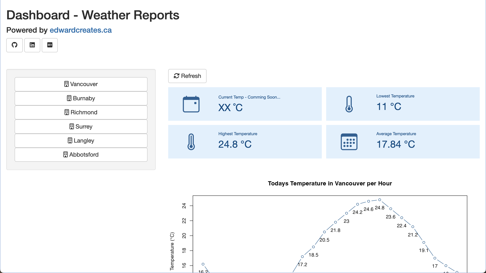
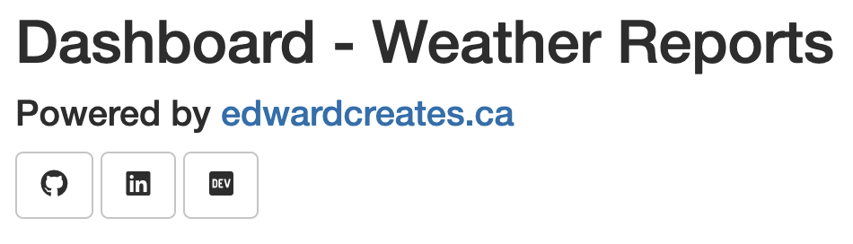
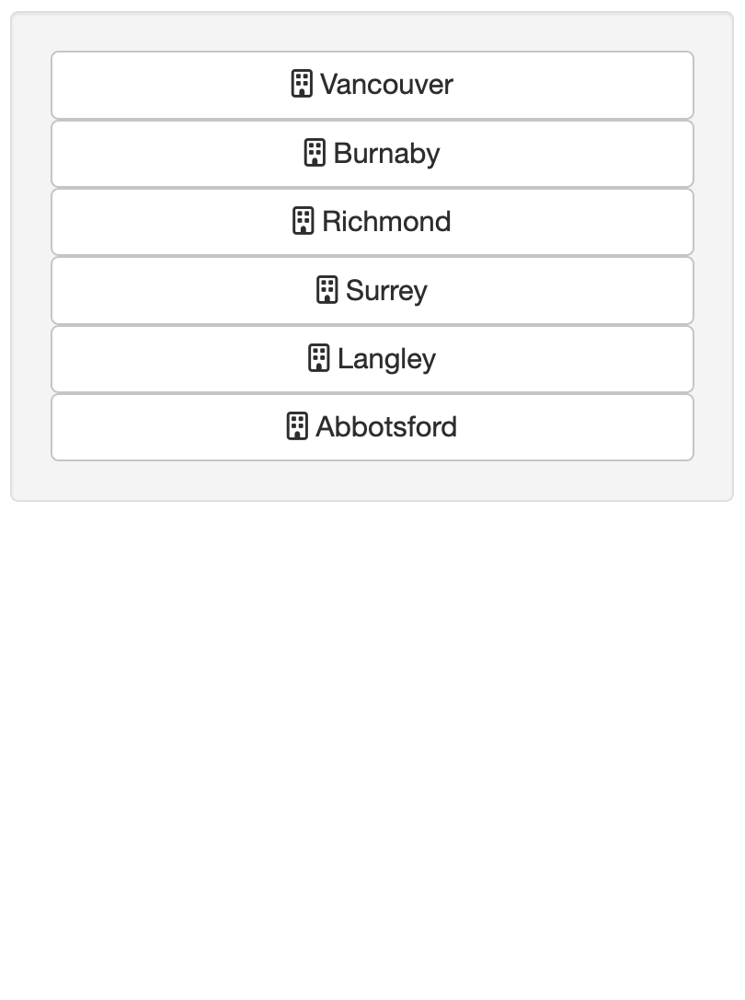
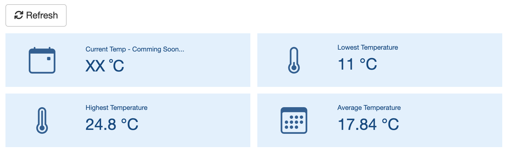
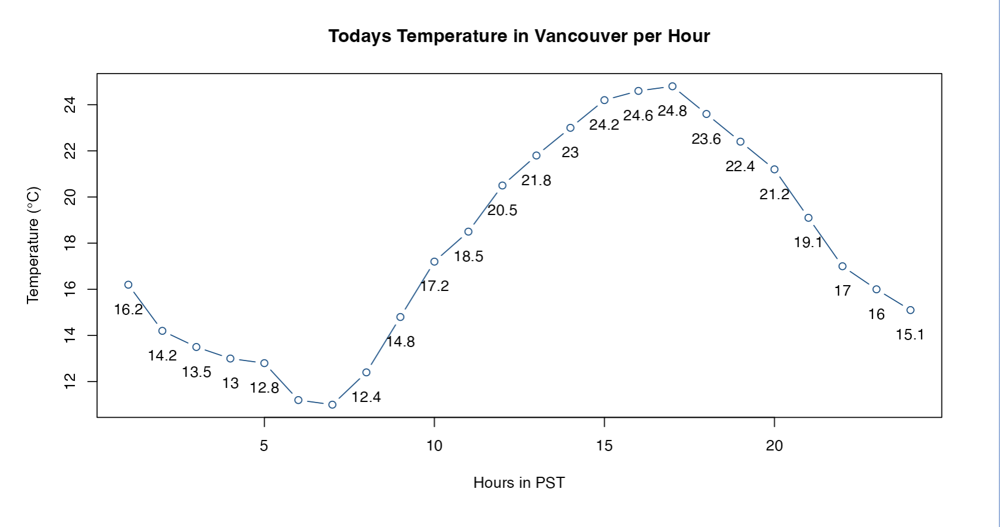
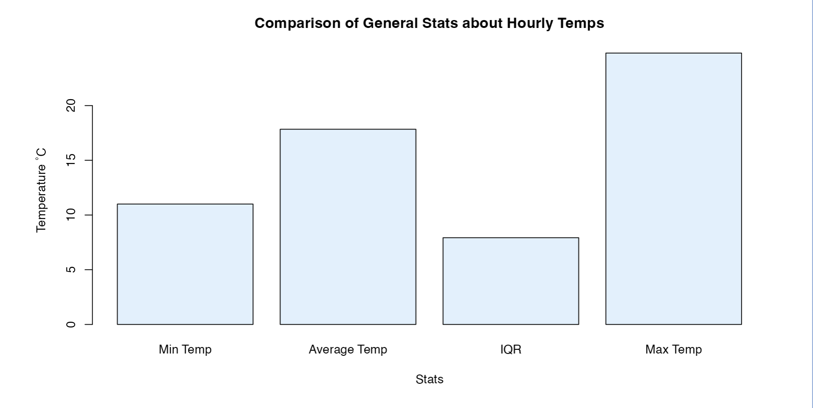
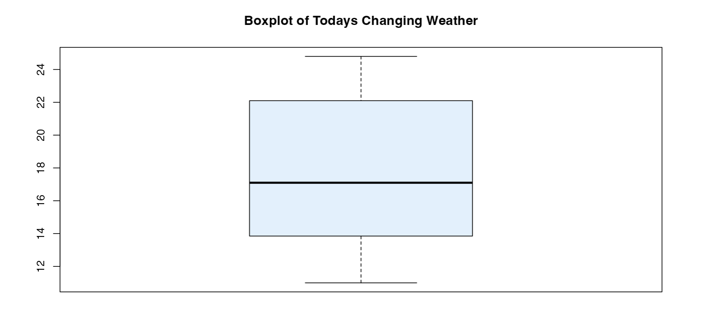

# Weather App

This project was made using R and Shiny. Its pulls data from [open-meteo.com](https://open-meteo.com/). Its a simple directory, with the `app.R` file holding the shiny application, the readme and some other testing files for my own personal use. It doesn't have any personal data, but the purpose of using those files are for my understanding.

# Table of Contents

-   [Weather App](#Weather App)

-   [Page Layout]

    -   [Home]

    -   [Header]

    -   [Sidebar]

    -   [Main Section]

        -   [Summary]

        -   [Line Chart]

        -   [Bar Chart]

        -   [Box Plot]

-   [Dependency List]

# Page layout

## Home

This is what the user will see. A header with a credit section and 1 sidebar and the insights I am providing. I've chosen this layout because I want to follow Shiny's recommended good practice of using the sidebar as the data inputs section and the main section as the output section.



## Header

The following has a page title and credits that should take you to my website and my socials. I've used the icons from awesome font. You can also use bootstrap, but understand the that these libraries are limited to the font thats already on there. Anything not on there required a custom icon.

{style="margin: auto;" width="525"}

## Sidebar

The first thing a user should do (besides browsing), is selecting your desired city. My plan is to separate each city and not use a drop down menu because I want to control the selection of cities. This limits to the choices to the most of Metro Vancouver, Greater Vancouver and a small portion of the Fraser Valley.

I actually want a navbar for the side where the selection takes up the entire sidebar, therefore looking cleaner.

{width="298"}

## Main Section

The main section holds the actual data insights expressed as calculated numbers and charts.

### Summary

The following are the calculated numbers that display the temperature:



The Refresh button will reset the R interpreter on the server. If things don't look right on this application, you have a choice.

### Line Chart

This is one of the most important insight. This chart will give you hour-by-hour LIVE temperatures in Vancity. Today was quite the shock in weather fluctuations. In 5 hours, the temperature increases by 7˚C or 1.4˚C/hour! That's a 40.7% increase in vancity!! Drake isn't the only one getting cooked. (This was May 10th, 2024).

### 

Theres currently a bug in how the time is being displayed. For now, I've comprimised by showing 0-24.

### Bar Chart

The values from our summary are display as a bar chart as well. This will be an example of using a bar chart. The only real insight there is, is the comparing heights in each column.



### Box Plot

The box plot does give a unique perspective relative to the bar chart. Sure we know the min and max. Where the IQR starts and ends... Not so much.



# Dependency List

``` r
library(shiny)
library(bslib)
library(httr)
library(jsonlite)
library(lubridate)
```
